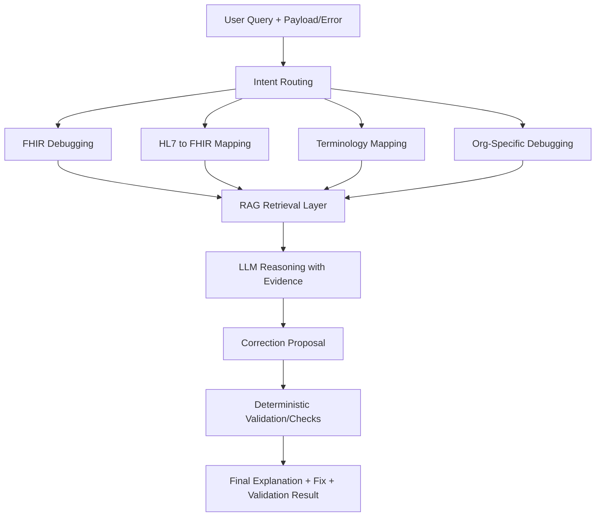
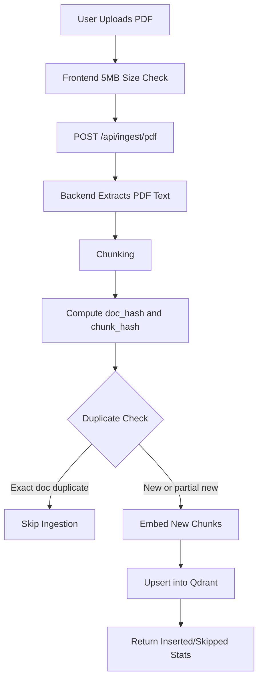

# Healthcare Interoperability Assistant

An AI assistant for healthcare interoperability tasks, built with Retrieval-Augmented Generation (RAG), deterministic tooling, and domain-focused prompting.

This repository includes a working FastAPI backend and Streamlit frontend, plus Qdrant-backed retrieval for interoperability use cases.

## Problem

Healthcare interoperability work is difficult because teams must combine multiple standards and local implementation rules at the same time.

Typical challenges are:

- Debugging invalid FHIR payloads against strict profile constraints
- Converting custom business JSON into valid FHIR resources
- Translating HL7 v2 messages into FHIR resources correctly
- Mapping local codes to standard terminology systems
- Explaining failures caused by hospital-specific or vendor-specific interface rules

This assistant now also supports universal format conversion between JSON, FHIR, and HL7 for common interoperability flows.

This project solves these as one unified assistant (not five separate demos).

### 1. FHIR Validation and Debugging (Flagship)

Many teams build FHIR JSON that looks correct but still fails in real systems because profiles have strict rules. This assistant helps you understand exactly what went wrong and how to fix it, instead of guessing. It points to the exact path of the issue and explains the rule in plain language. It also suggests a corrected payload shape so teams can test quickly.

Example:

Input payload:

```json
{
  "resourceType": "Observation",
  "status": "final",
  "subject": {
    "reference": "Patient/123"
  }
}
```

Issue:

- The payload does not include `code`, so many Observation profiles will reject it.

Solution suggested by assistant:

- Add only the missing required field first (`code`) and re-validate.

Example output (corrected payload):

```json
{
  "resourceType": "Observation",
  "status": "final",
  "code": {
    "text": "Blood glucose"
  },
  "subject": {
    "reference": "Patient/123"
  }
}
```

Optional next improvement after it passes required checks:

- Replace `code.text` with a coded concept (for example LOINC coding) and add result fields such as `valueQuantity` when needed.

Input:

- FHIR JSON payload
- Validation error details
- FHIR profile/version

Output:

- Exact violated element/constraint explanation
- Suggested corrected payload
- Deterministic validation feedback

### 2. JSON to FHIR Conversion

Many teams have internal JSON payloads that are not in FHIR format. This assistant converts those payloads into valid FHIR resources and explains how each source field maps to FHIR fields. It helps teams migrate legacy integrations without rewriting everything at once. It also gives a practical starting point that can be profile-tuned later.

Example:

Input:

```json
{
  "patient_id": "12345",
  "test_name": "Blood glucose",
  "result_value": 98,
  "result_unit": "mg/dL",
  "effective_time": "2026-08-15T10:30:00Z"
}
```

Solution suggested by assistant:

- Choose `Observation` as the target FHIR resource type.
- Map patient reference, test label, measured value, and effective time into FHIR-compatible fields.

Example output:

```json
{
  "resourceType": "Observation",
  "status": "final",
  "subject": {
    "reference": "Patient/12345"
  },
  "code": {
    "text": "Blood glucose"
  },
  "valueQuantity": {
    "value": 98,
    "unit": "mg/dL"
  },
  "effectiveDateTime": "2026-08-15T10:30:00Z"
}
```

Input:

- Non-FHIR JSON payload
- Optional target profile/resource hint

Output:

- FHIR resource suggestion with mapped fields
- Explanation of source-to-target mapping decisions

### 3. HL7 v2 to FHIR Mapping

Hospitals still use many HL7 v2 messages, while modern apps often need FHIR. This assistant helps convert old message fields into the right FHIR structure and explains each mapping in simple words. It reduces manual spreadsheet-based mapping work and helps avoid field-level mistakes. Teams can see exactly how each segment contributes to the output resource.

Example:

Input:

```json
{
  "hl7_message": "MSH|^~\\&|LAB|HOSP|EHR|HOSP|202601011200||ORU^R01|123|P|2.3\\rPID|1||12345||DOE^JOHN\\rOBX|1|NM|GLU||98|mg/dL"
}
```

Solution suggested by assistant:

- Map `PID` segment to a FHIR `Patient` resource.
- Map `OBX` segment to a FHIR `Observation` resource.

Example output:

```json
{
  "patient": {
    "resourceType": "Patient",
    "id": "12345",
    "name": [
      {
        "family": "DOE",
        "given": ["JOHN"]
      }
    ]
  },
  "observation": {
    "resourceType": "Observation",
    "status": "final",
    "code": {
      "text": "GLU"
    },
    "valueQuantity": {
      "value": 98,
      "unit": "mg/dL"
    }
  }
}
```

Input:

- HL7 v2 message (MSH/PID/PV1/OBX, etc.)
- Target FHIR context

Output:

- Retrieved mapping rationale
- Field-level mapping explanation
- Converted FHIR-oriented result

### 4. Terminology Mapping

Local hospital codes are often not standard. This assistant suggests the nearest standard code and explains why it is a good match, so data can be shared correctly across systems. It helps teams normalize lab, diagnosis, and medication concepts before exchange. This improves interoperability quality and reporting consistency.

Example:

```json
{
  "local_code": "BS_FAST",
  "description": "Fasting blood sugar"
}
```

Solution suggested by assistant:

- Search standard terminology concepts that match fasting glucose.
- Return ranked candidates and explain why the top candidate is preferred.

Example output:

```json
{
  "top_match": {
    "system": "LOINC",
    "code": "1558-6",
    "display": "Glucose [Moles/volume] in Serum or Plasma --Fasting"
  },
  "alternatives": [
    {
      "system": "LOINC",
      "code": "2345-7",
      "display": "Glucose [Mass/volume] in Serum or Plasma"
    }
  ],
  "reason": "Top match explicitly includes fasting context"
}
```

Input:

- Local code and description

Output:

- Candidate standard mappings (LOINC/SNOMED CT/RxNorm)
- Explanation and confidence-oriented rationale

### 5. Organization-Specific Integration Debugging

Sometimes data is valid by public standards but still rejected by one hospital or vendor due to local interface rules. This assistant compares standard rules and local rules to find the real reason for rejection. It helps teams separate true standard errors from local policy mismatches. That shortens debugging cycles and reduces repeated failed submissions.

Example:

```json
{
  "organization": "Hospital-A",
  "message_type": "ADT_A01",
  "error": "Missing visit admit date/time",
  "hl7_message": "MSH|^~\\&|ADT|HOSP|EHR|HOSP|202601011200||ADT^A01|111|P|2.5\\rPID|1||12345||DOE^JOHN\\rPV1|1|I"
}
```

Solution suggested by assistant:

- Hospital-A requires `PV1-44` (admit date/time) for this message type.
- Add `PV1-44` in expected timestamp format before resubmission.

Example output:

```json
{
  "root_cause": "Hospital-A local interface rule requires PV1-44 for ADT_A01",
  "recommended_fix": "Populate PV1-44 with admit date/time, for example 202601011130",
  "status_after_fix": "Ready to resend after local rule compliance check"
}
```

Input:

- Error details
- Message/resource payload
- Organization-specific interface rules

Output:

- Standard vs local-rule discrepancy analysis
- Likely rejection reason and correction guidance

## Why This Project Exists

Healthcare integration teams work across fragmented standards and specifications (FHIR, HL7 v2, US Core, local hospital rules, and terminology systems such as LOINC/SNOMED CT/RxNorm).

This project aims to reduce integration friction by combining retrieval, deterministic parsing/validation utilities, and LLM reasoning into a single assistant workflow.

## What Is Implemented Today

- Dataset preparation scripts for FHIR, HL7 mapping, terminology mapping, and organization-rule artifacts
- Qdrant-backed vector storage and retrieval (optional FAISS fallback)
- Metadata-aware retrieval by document type (`fhir_profile`, `hl7_mapping`, `terminology_map`, `organization_rule`)
- Agent orchestration service with intent routing
- JSON-to-FHIR conversion capability for custom business payloads
- Universal conversion endpoint for JSON/FHIR/HL7 (`/api/convert`)
- PDF upload ingestion endpoint with dedup controls (`/api/ingest/pdf`)
- FastAPI backend endpoints (`/api/health`, `/api/query`, `/api/convert`, `/api/ingest/pdf`, `/api/reload`)
- Streamlit frontend with sample loaders and interactive workflow
- Deterministic helper tools:
  - HL7 parser (`MSH`, `PID`, `PV1`, `OBX` support)
  - Basic FHIR validation checks for key resources/profile patterns

## Technology Stack

### Language and Runtime

- Python 3.11+
- uv (environment and dependency management)

### Backend API

- FastAPI
- Uvicorn
- Pydantic

### Frontend

- Streamlit

### AI and Orchestration

- LangChain
- OpenAI-compatible chat models (OpenAI or Groq endpoint)

### Retrieval and Embeddings

- Qdrant (primary vector database)
- Optional FAISS local fallback
- HuggingFace sentence-transformer embeddings

### Interoperability and Conversion Utilities

- Deterministic HL7 v2 parser utilities
- Deterministic FHIR validation utilities
- Deterministic JSON/FHIR/HL7 conversion utilities

## Quick Start Guide

This section gives the fastest path to run the app end-to-end.

### Prerequisites

- Python >= 3.11
- `uv` package manager
- One LLM key: `OPENAI_API_KEY` or `GROQ_API_KEY`
- Qdrant database access:
  - `QDRANT_URL`
  - `QDRANT_API_KEY` (or `QDARNT_API_KEY` alias)
- Vector DB provider setting: `VECTOR_DB_PROVIDER=qdrant`
- PDF upload size setting: `PDF_UPLOAD_MAX_MB` (default `5`)

### Full Setup

1. Create and sync the environment:

```bash
uv venv
uv sync
```

2. Create `.env` values (if not already set):

```env
OPENAI_API_KEY=your_key_here
# or
GROQ_API_KEY=your_key_here

VECTOR_DB_PROVIDER=qdrant
QDRANT_URL=your_qdrant_url
QDRANT_API_KEY=your_qdrant_api_key
QDRANT_COLLECTION_NAME=healthcare_interop_assistant
```

3. Prepare dataset and build vectors:

```bash
uv run python -m src.scripts.download_dataset
uv run python -m src.rag.ingest
```

### Running Locally

1. Start backend API:

```bash
uv run uvicorn src.api.app:app --host 0.0.0.0 --port 8000 --reload
```

2. In a second terminal, start Streamlit:

```bash
uv run streamlit run app.py
```

3. Open locally:

- API docs: http://localhost:8000/docs
- Health check: http://localhost:8000/api/health
- Frontend: http://localhost:8501

### Universal Conversion API

You can convert formats directly with `POST /api/convert`.

Supported conversion directions:

- `json -> fhir`
- `json -> hl7`
- `fhir -> json`
- `fhir -> hl7`
- `hl7 -> json`
- `hl7 -> fhir`

Example request:

```json
{
  "source_format": "json",
  "target_format": "fhir",
  "payload": "{\"patient_id\":\"12345\",\"test_name\":\"Blood glucose\",\"result_value\":98,\"result_unit\":\"mg/dL\"}",
  "resource_type": "Observation"
}
```

Example response keys:

- `source_format`
- `target_format`
- `converted_payload`
- `converted_json`
- `notes`
- `warnings`

### PDF Upload Ingestion API

`POST /api/ingest/pdf` supports direct PDF ingestion to Qdrant.

Form fields:

- `file`: PDF file (max size controlled by `PDF_UPLOAD_MAX_MB`)
- `doc_type`: optional metadata label (default: `pdf_upload`)
- `dedup_mode`: `strict` or `none`

Response includes:

- `status` and `reason`
- `filename`
- `doc_hash`
- `pages`
- `chunks_total`
- `chunks_inserted`
- `chunks_skipped_duplicate`
- `collection`

## End-to-End Flow (Architecture)



## Ingestion and Dedup Flow (Architecture)



Dedup strategy:

- Document-level dedup uses SHA256 `doc_hash`
- Chunk-level dedup uses normalized-text SHA256 `chunk_hash`
- Deterministic point IDs keep ingestion idempotent

## Workflow

Core demo workflow (FHIR-first and integrated):

1. User submits a payload and issue context.
2. Assistant routes intent to the right capability.
3. Relevant standards/org docs are retrieved from the vector store.
4. LLM generates explanation and correction guidance.
5. Deterministic checks validate key constraints.
6. Assistant returns explanation, correction, and evidence context.

## Evaluation Criteria

| Criterion | Current Status | Where to Review |
|---|---|---|
| Problem definition and domain relevance | Implemented | This README (`Problem`, `Why This Project Exists`) |
| Unified one-app strategy across 5 problems | Implemented | This README (`Problem` section and 5 subsections) |
| FHIR debugging as flagship capability | Implemented | This README (`Problem` subsection 1, `Workflow`) |
| Data preparation coverage | Implemented | `src/scripts/download_dataset.py`, `data/` |
| Retrieval pipeline | Implemented | `src/rag/ingest.py`, `src/rag/retriever.py` |
| Orchestration and tool flow | Implemented | `src/agents/agent_service.py`, `src/tools/` |
| Reproducible run/test steps | Implemented | `Quick Start Guide`, `Testing` sections |
| UI/demo workflow | Implemented | `frontend/app.py` |
| Automated tests/evals | Planned | `tests/`, `evals/` |

## Testing

### 1. Health test

Open http://localhost:8000/api/health and verify:

- `vector_db_provider` is `qdrant`
- `qdrant_connected` is `true`
- `qdrant_collection_exists` is `true`
- `ready` is `true`

### 2. API test

Open http://localhost:8000/docs and call `POST /api/query` with a sample payload.

Expected response includes:

- `intent`
- `explanation`
- `correction`
- optional `validation_result` and `citations`

Also call `POST /api/convert` with a conversion payload.

Expected response includes:

- `source_format`
- `target_format`
- `converted_payload`
- optional `converted_json`, `notes`, `warnings`

### 3. Frontend test

At http://localhost:8501:

1. Click `Check Health`
2. Load a sample scenario
3. Click `Run`
4. Verify result sections render without API errors

### 4. Ingestion troubleshooting

If ingestion fails:

1. Check `.env` for Qdrant URL and API key values
2. Confirm collection/provider values are set
3. Confirm network access to Qdrant cluster
4. Re-run `uv sync` and ingestion

## Project Structure

```text
healthcare-interoperability-assistant/
├── app.py                              # Root Streamlit launcher entry point
├── data/                               # Local datasets, downloaded artifacts, and vector data inputs
│   ├── cache/                          # Temporary cached files from dataset fetch/preprocessing
│   ├── fhir/                           # FHIR StructureDefinitions, ValueSets, and profile source files
│   ├── hl7/                            # HL7 v2 to FHIR mapping reference files
│   ├── organization/                   # Organization-specific interface rules and integration notes
│   ├── terminology/                    # Terminology mapping resources (LOINC, SNOMED CT, RxNorm)
│   └── vectorstore/                    # Optional local FAISS fallback artifacts
├── docs/                               # Supporting documentation and run guides
│   ├── setup.md                        # Environment setup instructions
│   └── usage.md                        # Example workflows and API usage notes
├── evals/                              # Evaluation scripts/artifacts (currently empty)
├── frontend/                           # Streamlit frontend source package
│   └── app.py                          # Streamlit UI
├── src/                                # Core application source code
│   ├── agents/                         # Intent routing and agent orchestration logic
│   │   └── agent_service.py            # Prompting, intent routing, and orchestration flows
│   ├── api/                            # FastAPI app wiring, routes, and request/response schemas
│   │   ├── app.py                      # FastAPI application setup and metadata
│   │   ├── routes.py                   # REST API endpoints (query, convert, ingest)
│   │   └── schemas.py                  # Pydantic request/response models
│   ├── config/                         # Environment/config loading and defaults
│   │   └── config.py                   # Config loader merging env vars and config.json
│   ├── guardrails/                     # Guardrail rules and validators (currently empty)
│   ├── llm/                            # LLM client/provider setup and model service logic
│   │   └── llm_service.py              # LLM and embedding provider initialization
│   ├── rag/                            # Retrieval pipeline: ingestion, indexing, and runtime retrieval
│   │   ├── ingest.py                   # Batch ingestion/chunking/index build pipeline
│   │   ├── rag_service.py              # RAG orchestration used by runtime query flows
│   │   └── retriever.py                # Retrieval and ranking helpers
│   ├── scripts/                        # Utility scripts for dataset preparation and maintenance tasks
│   │   └── download_dataset.py         # Downloads and prepares source datasets
│   ├── services/                       # Runtime service layer integrating tools, RAG, and LLM outputs
│   │   ├── interoperability_runtime.py # Runtime facade for query, conversion, and ingestion
│   │   └── pdf_ingestion_service.py    # PDF extraction, dedup, and Qdrant upsert flow
│   ├── tools/                          # Deterministic helper tools for FHIR and HL7 processing
│   │   ├── conversion_tools.py         # Deterministic JSON/FHIR/HL7 conversion utilities
│   │   ├── fhir_tools.py               # FHIR validation and profile utility helpers
│   │   └── hl7_tools.py                # HL7 parsing and normalization helpers
│   └── main.py                         # Python package main entry point
├── tests/                              # Automated tests (currently empty)
├── .env                                # Local environment values (secrets/config; do not commit real secrets)
├── .env.example                        # Safe template of required environment variables
├── .gitignore                          # Git ignore rules
├── LICENSE                             # Project license
├── config.json                         # Project runtime defaults and static settings
├── pyproject.toml                      # Python project metadata and dependencies
├── uv.lock                             # Locked dependency graph for reproducible installs
└── README.md                           # Project documentation and architecture guide
```

## Dataset

The knowledge layer combines structured standards and organization-style integration rules.

Sources used:

- FHIR StructureDefinitions and ValueSets in `data/fhir`
- HL7 v2 to FHIR mappings in `data/hl7`
- Terminology mappings in `data/terminology`
- Organization-specific docs (CSV/Markdown/Text) in `data/organization`

Dataset preparation is handled by:

- `src/scripts/download_dataset.py`

Vectorization and indexing are handled by:

- `src/rag/ingest.py`

## Limitations

- No formal evaluation scripts are committed under `evals/` yet
- No automated test suite is committed under `tests/` yet
- Validation logic is currently simplified for selected constraints
- Ingestion currently recreates the target Qdrant collection on each run (`force_recreate=True`)
